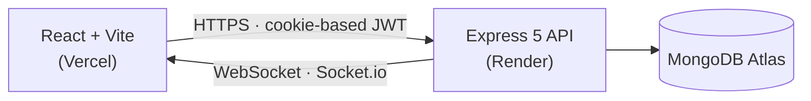

<div align="center">

# DevLog

**A real-time, full-stack issue tracker for engineering teams.**

Kanban boards, live updates, and role-based access — built on the MERN stack.

[](https://client-tan-omega-94.vercel.app)


**[Live Demo →](https://client-tan-omega-94.vercel.app)**

</div>

---

> **Status:** Fully deployed and live — frontend on Vercel, API on Render, database on MongoDB Atlas. Register a new account or use the demo credentials below.
>
> The API runs on Render's free tier, which sleeps after 15 minutes of inactivity. The first request after a period of idle time may take 30–50 seconds to wake up — subsequent requests are instant.

## Overview

DevLog is a Linear/Jira-style issue tracker built to demonstrate a production-shaped MERN application: cookie-based JWT auth, a drag-and-drop Kanban workflow, live multi-client sync over WebSockets, and role-gated access control — all with a clean, custom-built UI (no component library).

## Features

| | |
|---|---|
| 🔐 **Authentication** | JWT in httpOnly cookies, bcrypt-hashed passwords, register / login / logout / session restore |
| 🗂️ **Kanban board** | Drag-and-drop issues across status columns via `@hello-pangea/dnd` |
| ⚡ **Real-time sync** | Socket.io broadcasts issue changes instantly to every connected client |
| 🎯 **Issue tracking** | Create, edit, and triage issues with priority and status badges |
| 🛡️ **Role-based access control** | `admin` / `developer` roles, protected routes, scoped permissions |
| 📊 **Dashboard** | Live project metrics and activity at a glance |
| 👥 **Team management** | View and manage project members |

## Tech Stack

| Layer | Technologies |
|---|---|
| **Frontend** | React 19 · Vite · React Router v7 · Tailwind CSS v4 · Axios · Socket.io-client · react-hot-toast · lucide-react |
| **Backend** | Node.js · Express 5 · MongoDB · Mongoose 9 · Socket.io · JWT · bcryptjs · cookie-parser · cors |
| **Deployment** | Vercel (frontend) · Render (API) · MongoDB Atlas (database) |

## Architecture



## Project Structure

```
devlog/
├── client/              React + Vite frontend
│   └── src/
│       ├── pages/       Dashboard, Board, Login, Register, Team
│       ├── components/  IssueCard, KanbanColumn, Sidebar, Navbar...
│       └── context/     Auth + Socket providers
└── server/               Express + MongoDB backend
    ├── routes/           auth, projects, issues, users
    ├── models/           User, Project, Issue
    ├── middleware/       JWT verification
    └── socket/           Real-time event handling
```

## Getting Started

### Prerequisites
- Node.js 18+
- A MongoDB instance ([MongoDB Atlas](https://www.mongodb.com/atlas) free tier works)

### 1. Clone & install
```bash
git clone https://github.com/Learnee-debug/Devlog.git
cd Devlog/devlog
npm run install:all
```

### 2. Configure environment variables

Create `server/.env`:
```env
MONGO_URI=your_mongodb_connection_string
JWT_SECRET=your_jwt_secret
CLIENT_URL=http://localhost:5173
PORT=5000
NODE_ENV=development
```

### 3. Seed sample data (optional)
```bash
npm run seed
```
Creates two demo accounts:

| Email | Password | Role |
|---|---|---|
| `admin@devlog.com` | `password123` | admin |
| `dev@devlog.com` | `password123` | developer |

### 4. Run locally
```bash
npm run dev:server   # API   → http://localhost:5000
npm run dev:client   # App   → http://localhost:5173
```

## API Reference

| Method | Endpoint | Description |
|---|---|---|
| `POST` | `/api/auth/register` | Create a new account |
| `POST` | `/api/auth/login` | Log in, sets auth cookie |
| `POST` | `/api/auth/logout` | Clear auth cookie |
| `GET` | `/api/auth/me` | Get the current authenticated user |
| `GET` `POST` | `/api/projects` | List / create projects |
| `GET` `POST` `PATCH` | `/api/issues` | List / create / update issues |
| `GET` | `/api/users` | List team members |
| `GET` | `/api/health` | Health check |

## Deployment

| Service | Provider | Notes |
|---|---|---|
| Frontend | [Vercel](https://client-tan-omega-94.vercel.app) | Auto-builds from `client/` |
| Backend | [Render](https://devlog-ndbq.onrender.com) | Root: `server/` · Build: `npm install` · Start: `npm start` |
| Database | MongoDB Atlas | — |

Required production environment variables for the backend: `MONGO_URI`, `JWT_SECRET`, `CLIENT_URL`, `NODE_ENV=production`.

## License

ISC
